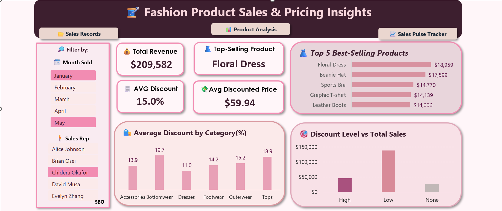
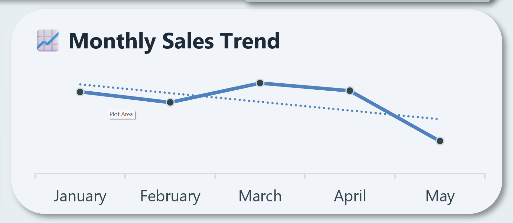
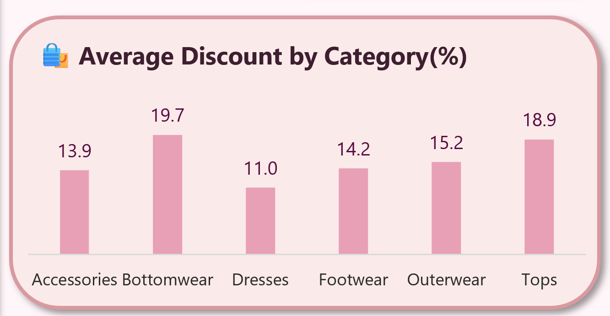

# 👗 Fashion Sales Dashboard (Excel)

This project explores fashion product sales data using Excel dashboards, pivot tables, and slicers to uncover actionable insights around product performance and sales rep contributions.

---

## 📸 Dashboard Preview

---

## 📊 Key Visuals

### 🗓️ Monthly Sales Trend  

### 🧍 Sales by Rep  

### 🛍️ Product Category Share  

---

## 🛠️ Tools & Features Used

- Microsoft Excel (2016)
- Pivot Tables
- Pivot Charts
- Slicers for interactivity
- Excel Formulas:
  - `= [Price ($)] * (1 - [Discount (%) / 100])`
  - `IF`, `MONTH`, `TEXT`
- Custom formatting & layout design
- Sheet linking with text boxes

---

## 🔁 Project Workflow

1. **Data Cleaning**  
   - Removed blanks, standardized formats, added columns like `Month Sold`, `Discounted Price`, and `Discount Level`

2. **Data Analysis (Pivot Tables)**  
   - Created views for product category performance and rep-wise sales breakdown

3. **Dashboard Design**  
   - Designed two dashboards with KPIs, slicers, and charts
   - Used meaningful colors and icons for storytelling
   - Made it understandable to everyday users

4. **Interactivity**  
   - Linked dashboards, data, and pivot sheets with clickable text boxes

---

## 💡 What This Solves

Helps stakeholders:
- Understand what products sell best
- See which reps are driving revenue
- Spot the effect of discounts on sales
- Track performance month-over-month

---

